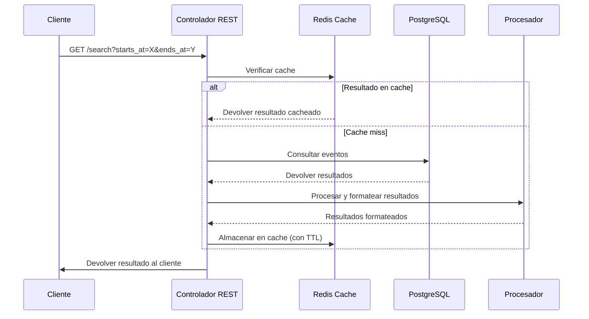
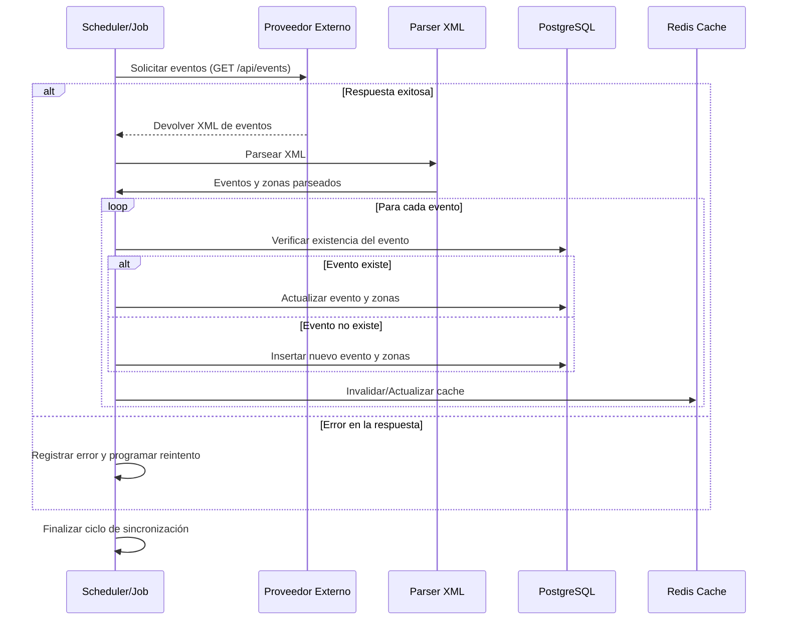

# Fever Events Service

## RFC – Integración de Eventos del Proveedor Externo en el Marketplace Fever

**Autor:** Manuel Sánchez del Campo  
**Fecha:** 06-02-2025  
**Revisión:** 1.0  
**Estado:** Borrador / En revisión

## Índice

1. [Introducción](#introducción)
2. [Antecedentes y Contexto](#antecedentes-y-contexto)
3. [Objetivos](#objetivos)
4. [Alcance](#alcance)
5. [Descripción del Problema](#descripción-del-problema)
6. [Estrategia de Persistencia y Caching](#estrategia-de-persistencia-y-caching)
   - [PostgreSQL como Fuente de Verdad](#postgresql-como-fuente-de-verdad)
   - [Redis como Capa de Caché](#redis-como-capa-de-caché)
   - [Integración de Ambas Soluciones](#integración-de-ambas-soluciones)
7. [Decisión Arquitectónica del Microservicio](#decisión-arquitectónica-del-microservicio)
   - [Arquitectura Hexagonal](#arquitectura-hexagonal-ports--adapters)
   - [Diseño Basado en Dominio (DDD)](#diseño-basado-en-dominio-ddd---domain-driven-design)
   - [Patrón CQRS Simplificado](#patrón-cqrs-simplificado)
   - [Persistencia con PostgreSQL](#persistencia-con-postgresql)
   - [Capa de Caché con Redis](#capa-de-caché-con-redis)
   - [Integración con el Proveedor Externo](#integración-con-el-proveedor-externo)
   - [Resiliencia y Manejo de Errores](#resiliencia-y-manejo-de-errores)
   - [Escalabilidad y Despliegue](#escalabilidad-y-despliegue)
   - [Beneficios ante los Requisitos](#beneficios-ante-los-requisitos)
8. [Enfoque de Despliegue: Contenedores y Alternativas](#enfoque-de-despliegue-contenedores-y-alternativas)
9. [Consideraciones Adicionales](#consideraciones-adicionales)
10. [Extra Mile: Escalabilidad y Rendimiento](#extra-mile)
11. [Conclusión](#conclusión)

## 1. Introducción
Este documento describe la solución propuesta para integrar los eventos provenientes de un proveedor externo en el marketplace de Fever. La solución debe considerarse como un microservicio con pensamiento a largo plazo, permitiendo que futuros desarrolladores puedan mantener, escalar y evolucionar el código sin dificultad. Se abordarán aspectos de persistencia, caché distribuido, comunicación entre microservicios, despliegue en contenedores y estrategias de actualización de datos.

## 2. Antecedentes y Contexto
Fever dispone de un marketplace de eventos en constante crecimiento y se encuentra en una fase de expansión continua para incorporar nuevos proveedores. En este contexto, el desafío consiste en desarrollar un microservicio que cumpla con los siguientes objetivos:

### Integración de Datos Externos
- Obtener los eventos de un proveedor externo en formato XML.
- Garantizar la correcta extracción y normalización de la información.

### Persistencia y Actualización Constante
- Almacenar de forma persistente la información recibida para mantener un histórico actualizado.
- Mantener la base de datos sincronizada con la fuente externa.
- Reflejar los cambios en tiempo real, actualizando el estado de los eventos según la disponibilidad indicada por el proveedor.

### Exposición de Eventos Activos
- El endpoint `/search` debe exponer únicamente aquellos eventos activos.
- Solo se mostrarán eventos en "sell mode online" y que estén activos por el proveedor al momento de la consulta.

### Rendimiento y Resiliencia
- Garantizar tiempos de respuesta en el orden de cientos de milisegundos.
- Implementar estrategias de caching y una arquitectura robusta.
- Asegurar la disponibilidad del servicio incluso en presencia de fallos o retrasos en la comunicación con el proveedor externo.

### Arquitectura Robusta y Escalable
- Implementar un patrón arquitectónico que facilite la escalabilidad, modularidad y mantenibilidad del servicio en el tiempo.
- Asegurar que la solución pueda adaptarse a futuros cambios sin afectar el rendimiento o la estabilidad.

El endpoint del proveedor es:

```
https://provider.code-challenge.feverup.com/api/events
```

## 3. Objetivos

- **Integración y Normalización:** Obtener, parsear y normalizar los eventos y zonas del XML del proveedor.
- **Persistencia:** Almacenar la información en una base de datos (source-of-truth) con consultas optimizadas mediante índices y/o vistas materializadas.
- **Caché Distribuido:** Implementar una capa de caché utilizando el patrón Cache-Aside, para reducir la latencia del endpoint `/search` en escenarios de alta carga (picos de 5k a 10k RPS).
- **Endpoint de Búsqueda:** Exponer un endpoint REST que, utilizando parámetros `starts_at` y `ends_at`, devuelva los eventos vigentes con sus datos normalizados.
- **Sincronización Asíncrona:** Desarrollar un proceso configurable que sincronice periódicamente la información con el proveedor, realizando inserciones, actualizaciones y desactivaciones (upsert).
- **Despliegue en Contenedores:** Utilizar Docker y Docker Compose para el entorno de desarrollo, con posibilidad de migración a entornos orquestados en producción.

## 4. Alcance
Este RFC cubre la definición y estrategias de:

- Consumo y procesamiento del XML del proveedor.
- Persistencia (modelado de datos, índices y estrategias de actualización).
- Caché distribuido para el endpoint `/search`.
- Definición de endpoints y estrategias de consulta (incluyendo validaciones y manejo de errores).
- Estrategia de sincronización y actualización (comparativa entre diferentes estrategias y explicación de la estrategia seleccionada).

## 5. Descripción del Problema

### Desafíos

- **Consumo y Procesamiento:** El proveedor ofrece un XML con eventos. Los eventos que dejan de estar disponibles no se incluyen en la respuesta.
- **Identificación de Eventos:** Se recomienda utilizar `base_event_id` como identificador único.
- **Manejo de Zonas Duplicadas:** Consolidación de información cuando `zone_id` se repite dentro de un evento.
- **Temporalidad y Rango:** El endpoint `/search` deberá aceptar parámetros `starts_at` y `ends_at` y devolver exclusivamente los eventos que coincidan dentro de este rango de fechas, tengan un `sell_mode` online y que se encuentren activos en el momento de la consulta.
- **Rendimiento y Resiliencia:** Garantizar respuestas en el orden de cientos de milisegundos mediante el uso de una arquitectura que combine un gestor de base de datos optimizado y un sistema de cache, asegurando así la disponibilidad y rapidez del endpoint  `search` sin depender de la latencia o disponibilidad del proveedor externo.
- **Sincronización:** Job asíncrono con frecuencia configurable.

## 6. Estrategia de Persistencia y Caching

### 6.1. PostgreSQL como Fuente de Verdad

#### Almacenamiento Persistente
PostgreSQL se utilizará para guardar la información completa de los eventos y sus zonas. Es la base de datos de registro principal (*source-of-truth*), donde se registrarán:

- **Datos de eventos**: Identificadores, títulos, fechas, períodos de venta, etc.
- **Datos de zonas asociadas**: Capacidad, precio, etc.

#### Optimización de Consultas

- **Índices**: Se crearán índices en campos críticos como `event_start_date` y `event_end_date` para facilitar la consulta por rangos de fechas.
- **Consultas Eficientes**: Se diseñarán consultas SQL optimizadas para que el filtrado por fechas sea rápido, aprovechando los índices y, de ser necesario, vistas materializadas en escenarios complejos.

#### Escalabilidad de Lectura

En un escenario de alta carga, se puede optar por:
- **Réplicas de lectura**: Configurar réplicas de PostgreSQL para distribuir la carga de consultas, manteniendo la consistencia de los datos a través de replicación asíncrona.

---

### 6.2. Redis como Capa de Caché

#### Propósito del Caché

Redis actuará como un caché en memoria para reducir la latencia en el endpoint `/search` y disminuir la carga directa sobre PostgreSQL. Dado que se esperan picos de tráfico de **5k a 10k RPS**, el caché es clave para responder en el orden de **cientos de milisegundos**.

#### Patrón de Cache Aside

Se utilizará el patrón *cache-aside*:

1. **Consulta Inicial**: Cuando llega una petición al endpoint, se verifica si existe un resultado cacheado en Redis para el conjunto de parámetros (`starts_at` y `ends_at`).
2. **Cache Hit**: Si existe, se devuelve el resultado de Redis inmediatamente.
3. **Cache Miss**: Si no existe, se consulta PostgreSQL, se procesa la respuesta y se almacena el resultado en Redis con un **TTL (time-to-live)** apropiado.

#### Invalidación del Caché

- La actualización de datos se realiza a través de un **job asíncrono** que sincroniza la información con el proveedor externo.
- Tras actualizar PostgreSQL, se pueden **invalidar o refrescar** las entradas de caché relacionadas (por ejemplo, mediante eventos o simplemente con **TTLs cortos** en el caché que garanticen que la información no quede obsoleta durante mucho tiempo).

#### Configuración de Redis

- Se pueden definir **políticas de expiración** en función de la naturaleza de los datos.
- Dado que la sincronización se ejecuta cada ciertos minutos, un **TTL de 1 a 5 minutos** para las claves cacheadas podría ser razonable.
- En escenarios de picos, Redis se encargará de absorber la mayoría de las lecturas, asegurando que la consulta a la base de datos solo se produzca en caso de **cache miss**.

---

### 6.3. Integración de Ambas Soluciones

### Flujo General

#### **Actualización de Datos**

1. Un proceso asíncrono (**job o scheduler**) consume el XML del proveedor y actualiza PostgreSQL.
2. Tras la actualización, se invalidan o refrescan las claves de caché que puedan estar afectadas.

#### **Consulta del Endpoint `/search`**

1. Al recibir una solicitud, el sistema consulta Redis usando una **clave compuesta** (por ejemplo, hash de los parámetros `starts_at` y `ends_at`).
2. **Si el valor existe en caché**, se devuelve inmediatamente.
3. **Si no existe**, se consulta PostgreSQL, se genera la respuesta y se almacena en Redis.

#### Beneficios

- **Baja Latencia**: Redis permite respuestas en tiempos muy bajos (**sub-100 ms**) en escenarios de alto tráfico.
- **Resiliencia**: El endpoint sigue respondiendo rápidamente incluso si hay retrasos en el *job* de sincronización o en la actualización de la base de datos.
- **Escalabilidad**: La combinación de un **RDBMS** y una **capa de caché distribuida** permite manejar el escalado tanto a nivel de base de datos como a nivel de la aplicación.

### 6.4 Diagrama del Flujo 

Flujo de llamada a `/search`



Flujo del proceso de sincronizacion de datos desde el cliente y persistencia


## 7. Análisis de Estrategia para Actualización de Eventos en la BD

### Estrategia 1: Consulta Selectiva de IDs y Bulk Update para Inactivar Eventos Obsoletos

#### Pasos:

1. **Consulta ligera**: Se realiza una consulta para obtener únicamente los identificadores (IDs) de los eventos activos del proveedor.
2. **Cálculo de diferencia**: Se crea un conjunto de IDs que están en la base de datos pero no en la lista del proveedor (obsoletos).
3. **Bulk update**: Se ejecuta una operación en bloque que actualiza el campo `active` a `false` para esos IDs.
4. **Upsert de eventos del proveedor**: Se insertan o actualizan los eventos recibidos, marcándolos como `active = true`.

#### Ventajas:

- **Eficiencia en la consulta**: La consulta de IDs es muy ligera y rápida, consumiendo poco ancho de banda y memoria.
- **Optimización en la BD**: El bulk update de IDs obsoletos es una operación eficiente en el motor de la base de datos.
- **Menor carga en la capa de aplicación**: Se evita traer objetos completos, reduciendo la memoria y el procesamiento en la capa de negocio.

#### Desventajas:

- **Complejidad en la lógica**: Se requieren métodos adicionales en el repositorio y cálculos de diferencia en la aplicación.
- **Dependencia en la consistencia de los IDs**: Es crucial garantizar que los IDs sean únicos y bien indexados.

---

### Estrategia 2: Actualización Directa de la BD Sin Recuperar IDs

#### Pasos:

1. **Bulk Inactivation Directo**: Se ejecuta una consulta que marca `active = false` para todos los eventos en la BD cuyo `baseEventId` no se encuentre en la lista del proveedor.
2. **Upsert de eventos del proveedor**: Se insertan o actualizan los eventos recibidos, estableciendo `active = true`.

#### Ventajas:

- **Simplicidad en la implementación**: Se evita traer IDs y calcular la diferencia en la aplicación.
- **Mantenimiento más sencillo**: Se reducen los pasos intermedios en la lógica de actualización.

#### Desventajas:

- **Carga en la BD**: Si la tabla es grande, la consulta con `WHERE base_event_id NOT IN (...)` podría ser costosa.
- **Complejidad en la Query SQL**: Requiere optimización si el feed es extenso.

---

### Comparación Final

| Criterio            | Estrategia 1 | Estrategia 2 |
|---------------------|-------------|-------------|
| **Simplicidad**     | Mayor complejidad en la capa de aplicación | Lógica más sencilla |
| **Rapidez**         | Más eficiente con grandes volúmenes de datos | Puede ser más costosa en consultas grandes |
| **Carga en la BD**  | Optimiza la carga con consultas ligeras | Requiere evaluar todos los registros activos |
| **Escalabilidad**   | Más eficiente en bases de datos grandes | Depende de la optimización de la query |

---

### Conclusión

Dado un entorno con sincronización frecuente y gran volumen de registros, se recomienda **Estrategia 1: Consulta Selectiva de IDs y Bulk Update para Inactivar Eventos Obsoletos**, ya que:

- **Optimiza el procesamiento** al reducir la cantidad de datos transferidos y delegar la actualización en bloque al motor de la base de datos.
- **Mejora la escalabilidad y eficiencia**, al actualizar solo los eventos obsoletos en lugar de comparar todos los registros activos.
- **Reduce la carga en la aplicación**, evitando transferencias de objetos completos y trabajando solo con identificadores.

Si bien la **Estrategia 2** es más sencilla de implementar, su mayor carga en la base de datos la hace menos adecuada en escenarios de gran volumen y alta concurrencia.

### 8. Decisión Arquitectónica del Microservicio

#### Enfoque General

El microservicio ha sido diseñado siguiendo principios de **modularidad, escalabilidad y mantenibilidad**. La arquitectura elegida permite una evolución ágil del sistema, facilitando la incorporación de nuevas funcionalidades sin afectar su estabilidad. Se priorizó una estructura desacoplada para garantizar que cada componente pueda ser modificado o reemplazado sin impacto en el resto del sistema.

### Principales Decisiones

#### **1. Arquitectura Hexagonal (Ports & Adapters)**

Se ha adoptado una **arquitectura hexagonal**, también conocida como **Puertos y Adaptadores**, debido a sus ventajas en términos de:

- **Separación de preocupaciones:** La lógica de negocio está completamente aislada de los detalles de infraestructura y frameworks, promoviendo una estructura limpia y modular.
- **Flexibilidad y Adaptabilidad:** Facilita el reemplazo de tecnologías o proveedores sin afectar la lógica de negocio.
- **Testabilidad mejorada:** Permite realizar pruebas unitarias y de integración de manera más eficiente, sin dependencias de infraestructura.
- **Independencia tecnológica:** Evita acoplamientos con frameworks específicos, asegurando mayor longevidad del código.

La estructura del servicio se organiza en las siguientes capas:

- **Dominio:** Contiene las reglas de negocio centrales y modelos de datos.
- **Aplicación:** Define los casos de uso mediante puertos de entrada (*Input Ports*), asegurando que la lógica de negocio esté desacoplada de la implementación concreta.
- **Infraestructura:** Implementa los adaptadores para interactuar con bases de datos, sistemas de caché y APIs externas a través de puertos de salida (*Output Ports*).

#### **2. Diseño Basado en Dominio (DDD - Domain-Driven Design)**

Se han aplicado principios de **Domain-Driven Design (DDD)** para modelar el dominio del servicio:

- **Entidades y Agregados:** Se han definido modelos claros como `Event` y `Zone`, asegurando la integridad de los datos y la coherencia en las operaciones.
- **Servicios de Dominio:** La lógica de negocio se encapsula en servicios de dominio que implementan reglas específicas del negocio de eventos.

#### **3. Patrón CQRS Simplificado**

Se ha implementado una versión simplificada de **Command Query Responsibility Segregation (CQRS)** para mejorar el rendimiento y escalabilidad:

- **Consultas optimizadas:** La recuperación de datos utiliza índices y caché distribuido para mejorar la eficiencia.
- **Separación de responsabilidades:** Las operaciones de consulta (`search`) y escritura (`sync`) están desacopladas, permitiendo optimizar cada proceso de manera independiente.

#### **4. Persistencia con PostgreSQL**

- Se ha elegido **PostgreSQL** como base de datos principal, aprovechando sus capacidades de indexación y escalabilidad. .
- **Flyway** gestiona la versión de esquemas y migraciones de datos.

#### **5. Capa de Caché con Redis**

Para reducir la latencia en la consulta de eventos activos, se ha implementado una **capa de caché distribuida** basada en **Redis**, siguiendo un patrón **Cache-Aside**:

- **Consultas rápidas:** Permite respuestas en milisegundos sin acceder a la base de datos en cada solicitud.
- **TTL dinámico:** Se configura un tiempo de vida adecuado para evitar inconsistencias en datos desactualizados.
- **Invalidación eficiente:** La caché se refresca tras cada ciclo de sincronización con el proveedor externo.

#### **6. Integración con el Proveedor Externo**

- Se utiliza **Retrofit** para el consumo de la API del proveedor externo, garantizando una integración robusta y flexible.
- Se implementan mecanismos de **reintento automático y circuit breaker** con **Resilience4j** para manejar fallos en la comunicación.
- La sincronización se realiza de manera **asíncrona y configurable**, asegurando que la información de eventos esté siempre actualizada.

#### **7. Resiliencia y Manejo de Errores**

Para garantizar la estabilidad del servicio ante fallos externos o problemas de conectividad:

- **Resilience4j** gestiona **circuit breakers, retries y bulkheads**, mejorando la tolerancia a fallos.
- **Monitoreo con Prometheus y Grafana**, permitiendo visualizar métricas clave y detectar posibles cuellos de botella.
- **Logs estructurados con SLF4J y Logback**, facilitando la trazabilidad de errores.

#### **8. Escalabilidad y Despliegue**

El servicio está diseñado para soportar escalabilidad horizontal y despliegue en entornos productivos mediante **Docker y Kubernetes**:

- **Contenedores Docker:** Facilitan el despliegue y replicación del servicio.
- **Gestión centralizada de logs y métricas** con herramientas como **ELK Stack o Prometheus/Grafana**.

### Beneficios ante los Requisitos

| Requisito                         | Beneficio de la Arquitectura |
|-----------------------------------|------------------------------|
| **Alta Disponibilidad y Resiliencia** | Redis permite respuestas rápidas y Resilience4j mitiga fallos en APIs externas. |
| **Escalabilidad** | El diseño modular facilitan la escalabilidad horizontal. |
| **Mantenibilidad** | La arquitectura hexagonal separa responsabilidades, simplificando la evolución del código. |
| **Integración con el Proveedor** | Retrofit y mecanismos de resiliencia garantizan una comunicación robusta. |
| **Optimización de Consultas** | PostgreSQL con índices mejora el rendimiento de búsqueda. |

#### Conclusión

Esta arquitectura **ofrece una base sólida para el crecimiento y mantenimiento del sistema**, alineándose con las mejores prácticas de diseño y garantizando flexibilidad, escalabilidad y rendimiento óptimo. La separación de capas y la adopción de estándares modernos permiten un desarrollo sostenible a largo plazo, asegurando que el microservicio pueda evolucionar sin comprometer su estabilidad ni su eficiencia.

## 8. Enfoque de Despliegue: Contenedores y Alternativas

### 8.1 Uso de Docker y Docker Compose
- Microservicio: Spring Boot + PostgreSQL + Redis en contenedores.
- Entorno de desarrollo reproducible.

### 8.2 Propuesta de alternativas para Producción
- **Kubernetes:** Escalabilidad y gestión avanzada.
- **Servicios en la Nube:** Amazon RDS y Amazon ElastiCache.


## 9. Consideraciones Adicionales
- **Configurabilidad de la Sincronización:** Frecuencia ajustable en el futuro.
- **Manejo de Zonas Duplicadas:** Consolidación de datos.
- **Conversión de Fechas:** Manejo con zona horaria definida.

## 10. Extra Mile: Escalabilidad y Rendimiento
Aunque la solución propuesta cumple con los requisitos planteados y ofrece una base sólida, es importante considerar estrategias adicionales para escalar la aplicación y mejorar su rendimiento en escenarios reales. A continuación, se describen algunas recomendaciones y enfoques que se pueden aplicar para lograr una mayor escalabilidad y capacidad de respuesta, especialmente cuando se trabaja con archivos que contienen miles de eventos y cientos de zonas, y con picos de tráfico de entre 5k y 10k peticiones por segundo.

### 1. Optimización y Escalado de la Persistencia

#### Réplicas de Lectura en PostgreSQL
Configurar réplicas de lectura para distribuir la carga de consultas puede mejorar significativamente el rendimiento del endpoint `/search`. Las réplicas permiten que las consultas se sirvan desde instancias separadas, reduciendo la presión sobre la base de datos principal y mejorando la capacidad de respuesta durante picos de tráfico.

#### Uso de Vistas Materializadas
En escenarios donde la consulta de eventos requiere realizar cálculos complejos o unir múltiples tablas, el uso de vistas materializadas puede acelerar el procesamiento de las consultas. Estas vistas se pueden actualizar de forma periódica, ofreciendo un balance entre la frescura de los datos y el rendimiento.

### 2. Despliegue y Orquestación en Entornos de Producción

#### Migración a Kubernetes
Aunque Docker Compose es adecuado para entornos de desarrollo y pruebas, en producción se recomienda el uso de Kubernetes para:

- **Autoscaling:** Configurar escalado horizontal automático (Horizontal Pod Autoscaler) para ajustarse dinámicamente a la carga de tráfico.
- **Gestión de Configuraciones y Secretos:** Utilizar un patron de **configuración centralizada** para administrar las configuraciones y credenciales, permitiendo cambios dinámicos sin necesidad de redeploy.

#### Balanceo de Carga y CDN
Utilizar balanceadores de carga robustos y considerar la implementación de una CDN (Content Delivery Network) para distribuir el tráfico y mejorar la latencia global, especialmente en entornos geográficamente dispersos.

### 3. Monitoreo y Tuning en Tiempo Real

#### Herramientas de Monitoreo
Implementar soluciones de monitoreo (como Datadog y openSearch / Prometheus, Grafana y ELK Stack) para observar el comportamiento del sistema en tiempo real. Esto incluye métricas de rendimiento de la base de datos, uso de memoria en Redis, tiempos de respuesta del endpoint y la carga en cada microservicio.

### 4. Consideraciones Adicionales

#### Optimización de la Lógica de Negocio
Revisar periódicamente la lógica de procesamiento y actualización de eventos para identificar oportunidades de optimización, especialmente en la consolidación de zonas duplicadas y en la validación de datos.

#### Estrategia de Desacoplamiento
Continuar utilizando la arquitectura hexagonal para mantener el desacoplamiento entre la lógica de negocio y las dependencias tecnológicas. Esto facilita la incorporación de nuevas tecnologías y permite que cada componente escale de forma independiente.

Estas estrategias garantizarán que la aplicación se mantenga operativa y eficiente, incluso en condiciones de carga extrema.

## 11. Conclusión
Esta solución proporciona una arquitectura escalable, eficiente y mantenible para la integración de eventos del proveedor externo en el marketplace de Fever.


...
## Prerequisites

Before you begin, ensure you have the following installed:

- **Java Development Kit (JDK) 17** or later
- **Maven 3.6** or later
- **PostgreSQL 13** or later
- **Docker**

---

## Setup

### 1. Clone the repository

```bash
git clone https://github.com/your-organization/fever-events-service.git
cd fever-events-service
```

### 2. Configure application properties

Copy the `application.properties.example` file to `application.properties` and update the database connection details:

```bash
cp src/main/resources/application.properties.example src/main/resources/application.properties
```

Edit `src/main/resources/application.properties` and update the following properties:

```properties
spring.datasource.url=jdbc:postgresql://localhost:5432/fever_events
spring.datasource.username=your_username
spring.datasource.password=your_password
```

### 3. Build the project

```bash
mvn clean install
```

---

## Running the Application

### Run locally

```bash
mvn spring-boot:run
```

The application will start and listen on [`http://localhost:8080`](http://localhost:8080).

### Run with Docker

1. Build the Docker image:

   ```bash
   docker build -t fever-events-service .
   ```

2. Run the container:

   ```bash
   docker run -p 8080:8080 fever-events-service
   ```

---

## Running Tests

Execute the following command to run the tests:

```bash
mvn test
```

---

### Database Migrations

This project uses **Flyway** for database migrations. Migrations are automatically applied when the application starts. If you need to manually trigger a migration, use:

```bash
mvn flyway:migrate
```

### Monitoring

The application exposes health and metrics endpoints:

- **Health:** [`http://localhost:8080/actuator/health`](http://localhost:8080/actuator/health)
- **Metrics:** [`http://localhost:8080/actuator/metrics`](http://localhost:8080/actuator/metrics)

---

## Troubleshooting

If you encounter any issues with Flyway migrations, you can clean the database and start fresh:

```bash
mvn flyway:clean
```

Then, run the application again to apply all migrations.

---

## API Documentation

The API documentation is available via **Swagger UI**. Once the application is running, you can access it at:

[`http://localhost:8080/swagger-ui.html`](http://localhost:8080/swagger-ui.html)

This provides an interactive interface to explore and test the API endpoints.

