# Fever Events Service

# Table of Contents

- [Fever Events Service](#fever-events-service)
   - [RFC – External Provider Events Integration in the Fever Marketplace](#rfc--external-provider-events-integration-in-the-fever-marketplace)
   - [1. Introduction](#1-introduction)
   - [2. Background and Context](#2-background-and-context)
      - [External Data Integration](#external-data-integration)
      - [Persistence and Constant Updates](#persistence-and-constant-updates)
      - [Exposure of Active Events](#exposure-of-active-events)
      - [Performance and Resilience](#performance-and-resilience)
      - [Robust and Scalable Architecture](#robust-and-scalable-architecture)
   - [3. Objectives](#3-objectives)
   - [4. Scope](#4-scope)
   - [5. Problem Description](#5-problem-description)
      - [Challenges](#challenges)
   - [6. Persistence and Caching Strategy](#6-persistence-and-caching-strategy)
      - [6.1. PostgreSQL as the Source of Truth](#61-postgresql-as-the-source-of-truth)
      - [6.2. Redis as a Caching Layer](#62-redis-as-a-caching-layer)
      - [6.3. Integration of Both Solutions](#63-integration-of-both-solutions)
      - [6.4. Flow Diagram](#64-flow-diagram)
   - [7. Event Update Strategy Analysis](#7-event-update-strategy-analysis)
      - [Strategy 1: Selective ID Query and Bulk Update for Obsolete Events](#strategy-1-selective-id-query-and-bulk-update-for-obsolete-events)
      - [Strategy 2: Direct Database Update Without Retrieving IDs](#strategy-2-direct-database-update-without-retrieving-ids)
      - [Final Comparison](#final-comparison)
      - [Conclusion](#conclusion)
   - [8. Deployment Approach: Containers and Alternatives](#8-deployment-approach-containers-and-alternatives)
   - [9. Additional Considerations](#9-additional-considerations)
   - [10. Extra Mile: Scalability and Performance](#10-extra-mile-scalability-and-performance)
   - [11. Conclusion](#11-conclusion)

---

- [🚀 Fever Events Service - Setup Guide](#-fever-events-service---setup-guide)
   - [📌 Prerequisites](#-prerequisites)
   - [1️⃣ Clone the repository](#1️⃣-clone-the-repository)
   - [2️⃣ Configure application properties](#2️⃣-configure-application-properties)
   - [3️⃣ Start services with Docker](#3️⃣-start-services-with-docker)
   - [4️⃣ Build the application](#4️⃣-build-the-application)
   - [5️⃣ Run the application](#5️⃣-run-the-application)
   - [6️⃣ Run tests](#6️⃣-run-tests)
   - [7️⃣ Database Migrations (Flyway)](#7️⃣-database-migrations-flyway)
   - [8️⃣ Application Monitoring and Health](#8️⃣-application-monitoring-and-health)
   - [9️⃣ API Documentation (Swagger)](#9️⃣-api-documentation-swagger)
   - [🛠️ Troubleshooting](#️-troubleshooting)
   - [🎯 Process Summary](#-process-summary)
   - [🚀 Conclusion](#-conclusion)

## RFC – External Provider Events Integration in the Fever Marketplace

**Author:** Manuel Sánchez del Campo  
**Date:** 06-02-2025  
**Revision:** 1.0  
**Status:** Draft / Under Review

## 1. Introduction

This document describes the proposed solution for integrating events from an external provider into the Fever marketplace. The solution should be designed as a microservice with a long-term perspective, ensuring that future developers can maintain, scale, and evolve the code with ease. This document will cover aspects such as persistence, distributed caching, microservice communication, containerized deployment, and data update strategies.

## 2. Background and Context

Fever operates a rapidly growing event marketplace and is in a continuous expansion phase to incorporate new providers. In this context, the challenge is to develop a microservice that meets the following objectives:

### External Data Integration
- Retrieve events from an external provider in XML format.
- Ensure proper extraction and normalization of the information.

### Persistence and Constant Updates
- Persistently store received information to maintain an updated history.
- Keep the database synchronized with the external source.
- Reflect real-time changes, updating event statuses according to provider availability.

### Exposure of Active Events
- The `/search` endpoint must only expose active events.
- Only events in "sell mode online" and marked as active by the provider at the time of the query should be displayed.

### Performance and Resilience
- Ensure response times within hundreds of milliseconds.
- Implement caching strategies and a robust architecture.
- Guarantee service availability even in the event of failures or delays in communication with the external provider.

### Robust and Scalable Architecture
- Implement an architectural pattern that facilitates scalability, modularity, and maintainability over time.
- Ensure that the solution can adapt to future changes without impacting performance or stability.

The provider's endpoint is:

```
https://provider.code-challenge.feverup.com/api/events
```

## 3. Objectives

- **Integration and Normalization:** Retrieve, parse, and normalize the provider's XML events and zones.
- **Persistence:** Store information in a database (source-of-truth) with optimized queries using indexes and/or materialized views.
- **Distributed Cache:** Implement a cache layer using the Cache-Aside pattern to reduce latency on the `/search` endpoint under high load scenarios (peaks of 5k to 10k RPS).
- **Search Endpoint:** Expose a REST endpoint that, using `starts_at` and `ends_at` parameters, returns current events with normalized data.
- **Asynchronous Synchronization:** Develop a configurable process that periodically synchronizes data with the provider, handling inserts, updates, and deactivations (upsert).
- **Containerized Deployment:** Use Docker and Docker Compose for the development environment, with the possibility of migration to orchestrated production environments.

## 4. Scope

This RFC covers the definition and strategies for:

- Consumption and processing of the provider's XML data.
- Persistence (data modeling, indexing, and update strategies).
- Distributed cache for the `/search` endpoint.
- Definition of endpoints and query strategies (including validations and error handling).
- Synchronization and update strategies (comparison of different strategies and rationale for the chosen approach).

## 5. Problem Description

### Challenges

- **Consumption and Processing:** The provider delivers an XML with events. Events that are no longer available are not included in the response.
- **Event Identification:** It is recommended to use `base_event_id` as the unique identifier.
- **Handling Duplicate Zones:** Consolidation of information when `zone_id` is repeated within an event.
- **Temporality and Range:** The `/search` endpoint must accept `starts_at` and `ends_at` parameters and return only events that match the specified date range, have an online `sell_mode`, and are active at the time of the query.
- **Performance and Resilience:** Ensure responses within hundreds of milliseconds using a combination of an optimized database management system and a caching system, ensuring the availability and speed of the `/search` endpoint without relying on the latency or availability of the external provider.
- **Synchronization:** Configurable asynchronous job frequency.

## 6. Persistence and Caching Strategy

### 6.1. PostgreSQL as the Source of Truth

#### Persistent Storage
PostgreSQL will be used to store complete event and zone data. It serves as the primary database (*source-of-truth*), where the following information will be recorded:

- **Event Data:** Identifiers, titles, dates, sales periods, etc.
- **Associated Zone Data:** Capacity, price, etc.

#### Query Optimization

- **Indexes:** Indexes will be created on critical fields like `event_start_date` and `event_end_date` to facilitate range queries.
- **Efficient Queries:** Optimized SQL queries will be designed to ensure fast filtering by date, leveraging indexes and, if necessary, materialized views for complex scenarios.

#### Read Scalability

In high-load scenarios, the following strategies can be adopted:
- **Read Replicas:** Configure PostgreSQL replicas to distribute query load, maintaining data consistency through asynchronous replication.

---

### 6.2. Redis as a Caching Layer

#### Cache Purpose

Redis will act as an in-memory cache to reduce latency on the `/search` endpoint and lessen the direct load on PostgreSQL. Given expected traffic peaks of **5k to 10k RPS**, caching is crucial for response times within **hundreds of milliseconds**.

#### Cache-Aside Pattern

The *cache-aside* pattern will be implemented:

1. **Initial Query:** When a request reaches the endpoint, it checks if a cached result exists in Redis for the provided parameters (`starts_at` and `ends_at`).
2. **Cache Hit:** If it exists, Redis returns the result immediately.
3. **Cache Miss:** If not found, the query is made to PostgreSQL, the response is processed, and the result is stored in Redis with an appropriate **TTL (time-to-live)**.

#### Cache Invalidation

- Data updates occur through an **asynchronous job** that synchronizes information with the external provider.
- After updating PostgreSQL, relevant cache entries can be **invalidated or refreshed** (e.g., using event-driven invalidation or short **TTLs** to prevent stale data).

#### Redis Configuration

- Define **expiration policies** based on data characteristics.
- Given that synchronization runs at intervals, a **TTL of 1 to 5 minutes** for cached keys may be appropriate.
- During peak loads, Redis will handle most read requests, ensuring database queries only occur in case of a **cache miss**.

---

### 6.3. Integration of Both Solutions

#### **Data Update Process**

1. An asynchronous process (**job or scheduler**) consumes the provider's XML and updates PostgreSQL.
2. After updating, cache entries related to affected data are invalidated or refreshed.

#### **Querying the `/search` Endpoint**

1. Upon receiving a request, the system checks Redis using a **composite key** (e.g., hash of `starts_at` and `ends_at`).
2. **If the value exists in cache**, it is returned immediately.
3. **If not found**, PostgreSQL is queried, the response is generated, and stored in Redis.

#### Benefits

- **Low Latency:** Redis enables **sub-100 ms** response times under high traffic.
- **Resilience:** The endpoint remains responsive even with delays in synchronization jobs or database updates.
- **Scalability:** The combination of an **RDBMS** and a **distributed cache** supports both data and application scaling.

### 6.4. Flow Diagram

Call flow for `/search` endpoint.

```mermaid
sequenceDiagram
   participant S as Scheduler/Job
   participant P as External Provider
   participant X as XML Parser
   participant DB as PostgreSQL
   participant RC as Redis Cache

   S->>P: Request events (GET /api/events)
   alt Successful response
      P-->>S: Return XML with events
      S->>X: Parse XML
      X->>S: Parsed events and zones
      loop For each event
         S->>DB: Verify event existence
         alt Event exists
            S->>DB: Update event and zones
         else Event does not exist
            S->>DB: Insert new event and zones
         end
         S->>RC: Invalidate/Update cache
      end
   else Error in response
      S->>S: Log error and schedule retry
   end
   S->>S: Complete synchronization cycle
```



Flujo del proceso de sincronizacion de datos desde el cliente y persistencia


## 7. Event Update Strategy Analysis

### Strategy 1: Selective ID Query and Bulk Update for Obsolete Events

#### Steps:

1. **Lightweight Query**: Perform a query to retrieve only the identifiers (IDs) of active events from the provider.
2. **Difference Calculation**: Create a set of IDs that exist in the database but are not in the provider’s list (obsolete events).
3. **Bulk Update**: Execute a bulk operation to update the `active` field to `false` for those obsolete IDs.
4. **Upsert Provider Events**: Insert or update the received events, marking them as `active = true`.

#### Advantages:

- **Efficient Querying**: ID queries are lightweight and fast, consuming minimal bandwidth and memory.
- **Optimized Database Operations**: Bulk updates for obsolete IDs are efficient for database engines.
- **Reduced Application Load**: Avoids fetching full objects, reducing memory and processing load.

#### Disadvantages:

- **Complex Logic**: Requires additional repository methods and difference calculations in the application.
- **Dependency on ID Consistency**: Ensuring unique and well-indexed IDs is crucial.

---

### Strategy 2: Direct Database Update Without Retrieving IDs

#### Steps:

1. **Direct Bulk Inactivation**: Execute a query that sets `active = false` for all events in the database whose `baseEventId` is not in the provider’s list.
2. **Upsert Provider Events**: Insert or update the received events, setting `active = true`.

#### Advantages:

- **Simpler Implementation**: Avoids retrieving IDs and computing differences in the application.
- **Easier Maintenance**: Reduces intermediate steps in the update logic.

#### Disadvantages:

- **Database Load**: If the table is large, a query with `WHERE base_event_id NOT IN (...)` could be expensive.
- **Complex SQL Querying**: Requires optimization for large datasets.

---

### Final Comparison

| Criteria            | Strategy 1 | Strategy 2 |
|---------------------|-------------|-------------|
| **Simplicity**     | More complexity in application layer | Simpler logic |
| **Speed**         | More efficient with large data volumes | Can be costly for large queries |
| **Database Load**  | Optimized with lightweight queries | Requires evaluating all active records |
| **Scalability**   | More efficient for large databases | Depends on query optimization |

---

### Conclusion

In an environment with frequent synchronization and a large volume of records, **Strategy 1: Selective ID Query and Bulk Update for Obsolete Events** is recommended because:

- **Optimizes processing** by reducing transferred data and delegating bulk updates to the database engine.
- **Improves scalability and efficiency** by updating only obsolete events instead of comparing all active records.
- **Reduces application load**, avoiding full object transfers and working only with identifiers.

While **Strategy 2** is simpler to implement, its higher database load makes it less suitable for high-volume and high-concurrency scenarios.
## 8. Deployment Approach: Containers and Alternatives

#### 8.1 Using Docker and Docker Compose
- Microservice: Spring Boot + PostgreSQL + Redis in containers.
- Reproducible development environment.

#### 8.2 Alternative Proposals for Production
- **Kubernetes:** Advanced scalability and management.
- **Cloud Services:** Amazon RDS and Amazon ElastiCache.

---

## 9. Additional Considerations
- **Synchronization Configurability:** Adjustable frequency for future updates.
- **Handling Duplicate Zones:** Data consolidation.
- **Date Conversion:** Proper time zone management.

---

## 10. Extra Mile: Scalability and Performance
While the proposed solution meets the stated requirements and provides a solid foundation, additional strategies should be considered to scale the application and improve its performance in real-world scenarios. Below are recommendations and approaches that can be applied to enhance scalability and responsiveness, especially when handling files containing thousands of events and hundreds of zones, with traffic peaks between 5k and 10k requests per second.

### 1. Persistence Optimization and Scaling

#### Read Replicas in PostgreSQL
Configuring read replicas to distribute query load can significantly improve the performance of the `/search` endpoint. Replicas allow queries to be served from separate instances, reducing pressure on the primary database and improving responsiveness during traffic peaks.

#### Use of Materialized Views
In scenarios where event queries require complex calculations or multiple table joins, using materialized views can speed up query processing. These views can be periodically refreshed, providing a balance between data freshness and performance.

---

### 2. Deployment and Orchestration in Production Environments

#### Migration to Kubernetes
While Docker Compose is suitable for development and testing environments, Kubernetes is recommended for production to ensure:

- **Autoscaling:** Configuring horizontal auto-scaling (Horizontal Pod Autoscaler) to dynamically adjust to traffic load.
- **Configuration and Secret Management:** Implementing a **centralized configuration pattern** to manage configurations and credentials, allowing dynamic updates without requiring redeployment.

#### Load Balancing and CDN
Utilizing robust load balancers and considering the implementation of a Content Delivery Network (CDN) to distribute traffic and improve global latency, especially in geographically distributed environments.

---

### 3. Real-Time Monitoring and Tuning

#### Monitoring Tools
Implementing monitoring solutions (such as Datadog, openSearch / Prometheus, Grafana, and ELK Stack) to track system behavior in real-time. This includes database performance metrics, Redis memory usage, endpoint response times, and microservice load levels.

---

### 4. Additional Considerations

#### Business Logic Optimization
Periodically reviewing event processing and update logic to identify optimization opportunities, particularly in consolidating duplicate zones and validating data.

#### Decoupling Strategy
Continuing the use of hexagonal architecture to maintain separation between business logic and technological dependencies. This facilitates the integration of new technologies and allows each component to scale independently.

These strategies will ensure the application remains operational and efficient even under extreme load conditions.

--- 
## 11. Conclusion
 - This solution provides a scalable, efficient, and maintainable architecture for integrating external provider events into the Fever marketplace.
---

# 🚀 Fever Events Service - Setup Guide

This document explains how to set up and run **Fever Events Service** in your local environment.

## 📌 Prerequisites

Before getting started, make sure you have the following installed:

- **Java Development Kit (JDK) 17 or later**
- **Maven 3.6 or later**
- **PostgreSQL 13 or later**
- **Docker and Docker Compose**

---

## 1 Clone the repository

Run the following commands to clone the project:

```bash
git clone https://github.com/FeverCodeChallenge/manuel.sanchez.git
cd manuel.sanchez
```

---

## 2 Configure application properties

The application requires database connection settings and other services.

### 🔹 Current configuration (development)

Currently, the configuration parameters are explicitly defined in the `application.properties` file, as the application is in the development phase.  
To run the application locally, edit the file and update the database credentials:

```properties
spring.datasource.url=jdbc:postgresql://localhost:5432/fever_events
spring.datasource.username=your_username
spring.datasource.password=your_password
```

### ⚠️ Recommendation for production environments

For security reasons, **DO NOT** store sensitive credentials in configuration files. Instead, use **environment variables** or a **secrets manager** (such as Vault, AWS Secrets Manager, Azure Key Vault, etc.).

---

## 3 Start services with Docker

Before compiling and running the application, you need to start **PostgreSQL and Redis** using `docker-compose`:

```bash
docker-compose up -d
```

💪 **IMPORTANT**: This step is mandatory before running `mvn clean install`, as the application requires PostgreSQL and Redis to function.

To check if the services are running:

```bash
docker ps
```

To stop the services:

```bash
docker-compose down
```

💡 **Note on future improvements for tests**  
In a future development phase, test configurations should be modified to use an in-memory database that simulates PostgreSQL behavior (e.g., Testcontainers or H2 with PostgreSQL dialect). This will allow tests to run without requiring PostgreSQL and Redis, improving portability and test automation.

---

## 4 Build the application

Once the services are up with Docker, compile the project with:

```bash
mvn clean install
```

---

## 5 Run the application

### 🔹 Option 1: Run locally

Run the application on your machine:

```bash
mvn spring-boot:run
```

The application will be available at:  
📌 [http://localhost:8080](http://localhost:8080)

### 🔹 Option 2: Run with Docker

If you prefer to run the application inside a Docker container:

#### Build the Docker image:

```bash
docker build -t fever-events-service .
```

#### Run the container:

```bash
docker run -p 8080:8080 fever-events-service
```

---

## 6 Run tests

Execute unit and integration tests with:

```bash
mvn test
```

📝 **Note**: If tests fail due to connection issues with PostgreSQL or Redis, make sure `docker-compose` is running.

---

## 7 Database Migrations (Flyway)

The application uses **Flyway** to manage database migrations.

- Migrations run automatically when the application starts.
- If you need to apply them manually, use:

```bash
mvn flyway:migrate
```

### 🔹 Clean the database and reapply migrations from scratch

If there are migration errors, you can clean and reapply all:

```bash
mvn flyway:clean
mvn flyway:migrate
```

---

## 8 Application Monitoring and Health

The application exposes endpoints to check its status:

- **Health status**: [http://localhost:8080/actuator/health](http://localhost:8080/actuator/health)

---

## 9 API Documentation (Swagger)

To view the interactive API documentation, visit:

📌 [http://localhost:8080/swagger-ui.html](http://localhost:8080/swagger-ui.html)

This allows you to explore and test the endpoints easily.

---

## 🛠️ Troubleshooting

### 🔹 PostgreSQL is not connecting

If you see an error like:

```pgsql
Connection to localhost:5432 refused. Check that the hostname and port are correct.
```

**Solution**: Ensure PostgreSQL is running with:

```bash
docker-compose up -d
```

### 🔹 Redis is unavailable

If you see an error related to Redis:

```pgsql
Cannot connect to Redis on localhost:6379.
```

**Solution**: Ensure Redis is running with:

```bash
docker-compose up -d
```

### 🔹 Flyway migration errors

If Flyway fails to start:

```bash
mvn flyway:clean
mvn flyway:migrate
```

---

## 🎯 Process Summary

| Step | Action |
|---|--------|
| 1 | Clone the repository (`git clone`) |
| 2 | Configure `application.properties` |
| 3 | Start `docker-compose up -d` |
| 4 | Compile with `mvn clean install` |
| 5 | Run the application (`mvn spring-boot:run` or with Docker) |
| 6 | Run tests (`mvn test`) |
| 7 | Verify migrations (`mvn flyway:migrate`) |
| 8 | Monitor the application (`/actuator/health`, `/actuator/metrics`) |
| 9 | Access the API in [Swagger UI](http://localhost:8080/swagger-ui.html) |

---

## 🚀 Conclusion

This guide provides a clear and structured way to set up and run **Fever Events Service**.  
By following these steps in order, you will avoid errors and ensure a smooth execution of the application. 🔥🚀